<h3>COMPTE RENDU TP3 PARTIE1</h3>
<h4>ENTITE PATIENT</h4>
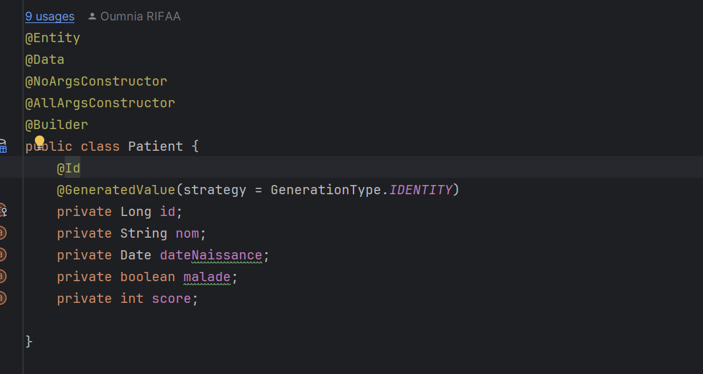
<h4>AJOUTER PATIENT</h4>
<h5>* Avec Constructeur avec Parametres</h5>
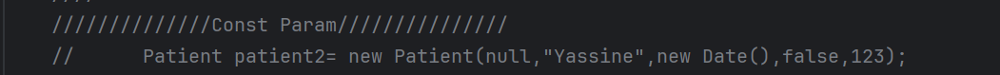
<h5>* Avec le constructeur sans parametres</h5>
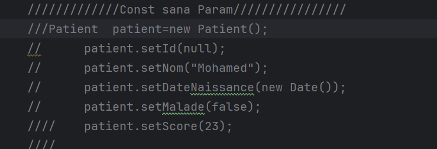
<h5>* Avec le builder</h5>
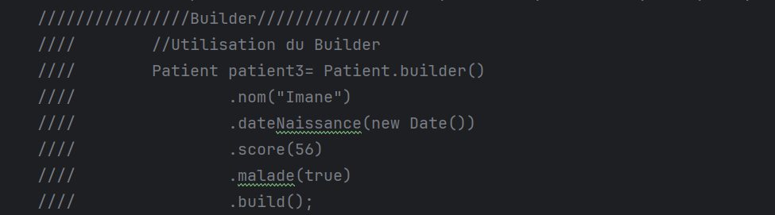
<h4>Base de donnees H2</h4>
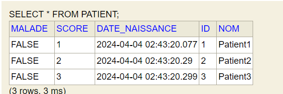
<h4>Base de donnees MySql</h4>

<h4>Controller Lister Patients</h4>
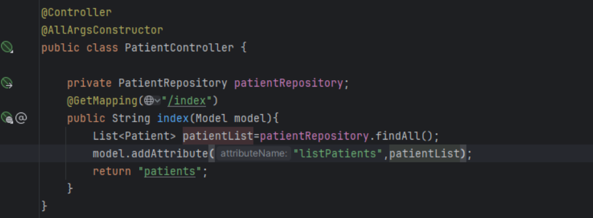
<h4>LISTER PATIENTS</h4>
<h5>* Liste des patients</h5>
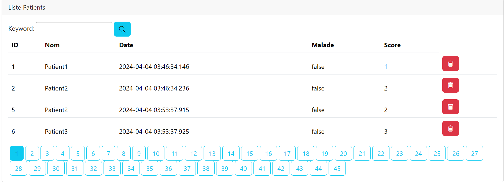
<h5>-------------HTML------------</h5>
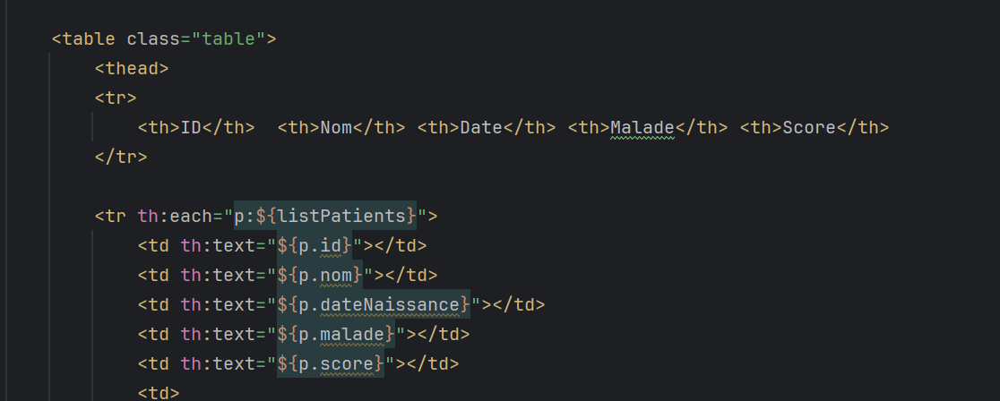
<h4>PAGINATION</h4>
<h5>* Controller</h5>
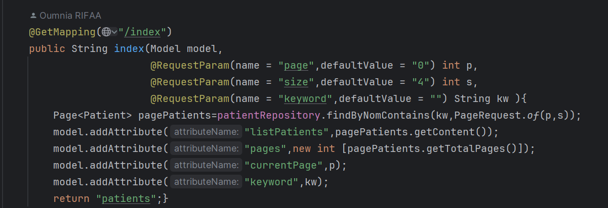
<h5>* Html</h5>

<h4>RECHERCHER PATIENT</h4>
<h5>* Controller</h5>
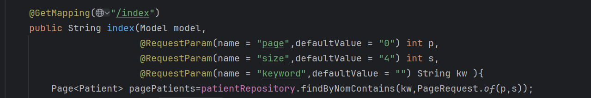
<h5>* Html</h5>
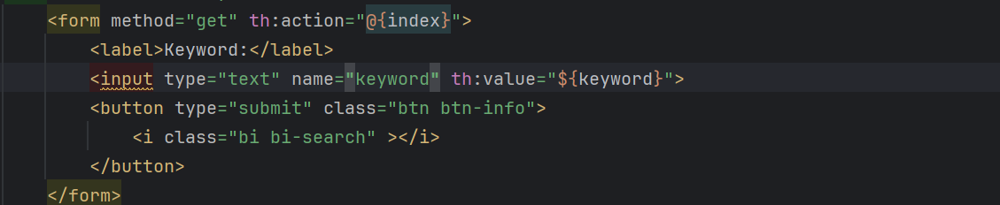
<h5>* Repository</h5>
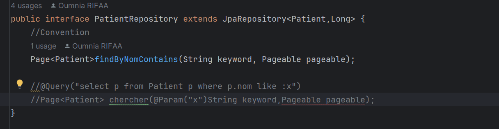
<h5>* Page web</h5>
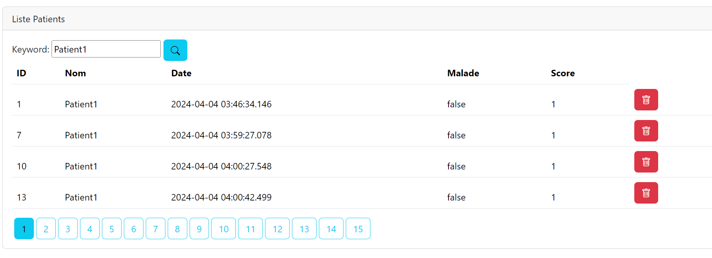
<h4>SUPPRIMER PATIENT</h4>
<h5>* Controller</h5>

<h5>* Page Web</h5>

<h5>* Html</h5>
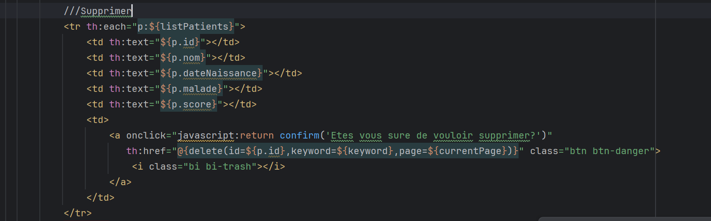

